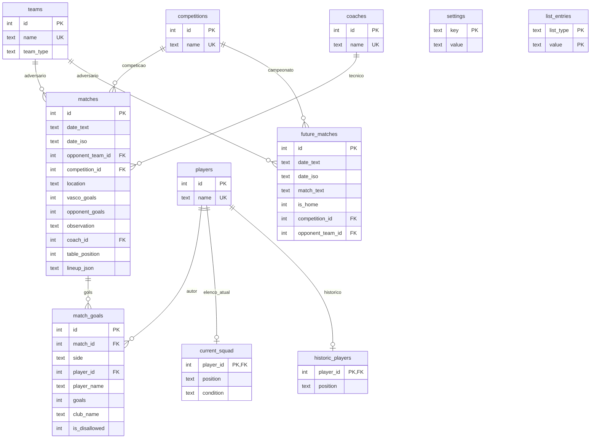

# Diagrama de Relacionamentos (SQLite)

## Observações
- A tabela `list_entries` preserva as listas auxiliares do app (clubes, jogadores, competições e técnicos).
- `settings` guarda configurações globais, como `tecnico_atual` e `elenco_tecnico`.
- `lineup_json` mantém a estrutura de escalação atual sem perda de compatibilidade com a UI existente.
